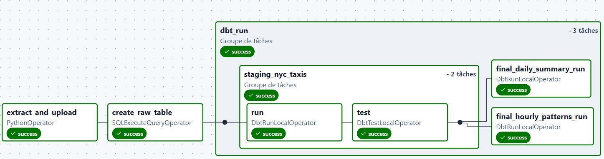
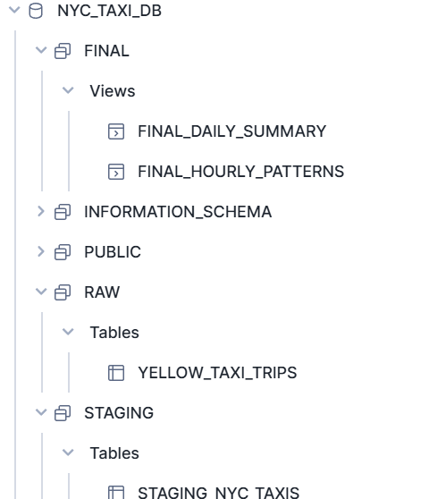

# NYC Taxi ETL with Airflow, Snowflake, and dbt

This repository contains a full ETL workflow to process NYC Taxi trip data using **Airflow**, **Snowflake**, and **dbt**. It is designed to download, store, transform, and validate Yellow Taxi trip data in a structured and incremental way.

---

## Table of Contents

- [Project Overview](#project-overview)  
- [Architecture](#architecture)   
- [Airflow](#airflow)  
- [DBT](#DBT)  
- [Snowflake](#snowflake)  

---

## Project Overview

This project automates the ingestion and transformation of NYC Taxi data:

1. **Extract:** Download monthly Yellow Taxi Parquet files from the official NYC TLC dataset.
2. **Load:** Upload files to Azure Blob Storage and copy them into Snowflake raw tables.
3. **Transform:** Apply dbt transformations to produce cleaned and structured staging and final tables.
4. **Validate:** Ensure data quality and consistency via dbt tests.

---

## Architecture

```yaml
  NYC Taxi Data (Parquet)
           |
           v
    Azure Blob Storage
           |
           v
   Snowflake RAW Tables
           |
           v
  dbt Transformations
  (STAGING -> FINAL)
           |
           v
   Analytics / BI Tools
```

- **Airflow** handles the orchestration of the workflow.
- **Snowflake** stores raw and transformed data.
- **dbt** manages transformations, incremental loads, and data validation.

## Airflow 

### nyc_taxi_workflow

## Airflow Workflow Overview with Technical Components

### Steps



The `nyc_taxi_workflow` DAG orchestrates NYC Yellow Taxi ETL in three main steps:

1. **Extraction and Upload**
   - **Purpose:** Download monthly NYC Yellow Taxi Parquet files and upload them to Azure Blob Storage.
   - **Technical Component:** `PythonOperator` executing the `extract_and_upload_to_blob` Python function, which handles HTTP requests, local storage, and Azure Blob uploads.

2. **Raw Table Load**
   - **Purpose:** Create and populate the Snowflake raw table `raw.yellow_taxi_trips` from the uploaded files.
   - **Technical Component:** `SQLExecuteQueryOperator` to run SQL scripts that:
     - Create the table if it does not exist.
     - Copy Parquet files from the stage into Snowflake.
     - Add `_ETL_EXTRACT_DT` timestamp.

3. **Transformation with dbt**
   - **Purpose:** Transform raw data into cleaned **staging** tables and aggregated **final** tables/views.
   - **Technical Component:** `DbtTaskGroup` calling dbt commands, handling:
     - Incremental loads.
     - Schema enforcement and type casting.
     - Data quality tests.
     - Derived metrics and aggregations.


Documentation is visible in the Airflow UI for both DAGs and tasks.

### Connections

- **azure_storage_conn** → Azure Blob Storage to store .parquet files.

- snowflake_conn → Snowflake to create tables and copy datas.

### Dependencies 

To run the dag, we need the following dependencies: 
- astronomer-cosmos
- apache-airflow-providers-snowflake
- apache-airflow-providers-microsoft-azure

## DBT

Connection to snowflake is made in the <code>profiles.yaml</code> file and use environment variables: 
```.env
export DBT_SNOWFLAKE_ACCOUNT="******-******"  
export DBT_ENV_SECRET_SNOWFLAKE_USER="username"  
export DBT_ENV_SECRET_SNOWFLAKE_PASSWORD="password"  
export DBT_SNOWFLAKE_ROLE="role"  
export DBT_SNOWFLAKE_DATABASE="NYC_TAXI_DB"
export DBT_SNOWFLAKE_SCHEMA="RAW"  
export DBT_SNOWFLAKE_WAREHOUSE="NYC_TAXI_WH"
```

**Models**:
- `staging/staging_nyc_taxis`: 

This dbt model transforms raw NYC Yellow Taxi trip data into a cleaned and typed staging table. It casts columns to the correct data types, filters out invalid trips (e.g., negative fares, pickup after dropoff, unrealistic distances), and adds derived metrics such as trip duration, average speed, and tip percentage. Incremental loading ensures that only new data is merged into the staging table. The yaml file allows to make data quality tests.

- `final/daily_summary` : 
Aggregates staging NYC Yellow Taxi data by day, providing daily metrics including total trips, average trip distance, and total revenue.

- `final/hourly_pattern`: 
Aggregates staging NYC Yellow Taxi data by hour, showing total trips, average speed, and total revenue for each hour of the day.

## Snowflake 

- **Database**: NYC_TAXI_DB

- **Warehouse**: NYC_TAXI_WH

- **Schemas**:

    - `RAW` → raw data

    - `STAGING` → cleaned, typed

    - `FINAL` → aggregated/analytics-ready




